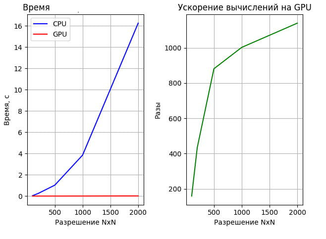

# Лабораторная работая  "Bilateral"
## Задача: 
- Реализовать билатеральный фильтр Язык: C++ или Python. 
    - Входные данные: изображение с различными разрешением. 
    - Выходные данные: проверка корректности  + время вычисления.

В данной лабораторной работе производился запуск программы для обработки изображения с использованием технологии CUDA. В программе необходимо применить билатеральный фильтрна изображениях с различными разрешениями. Код программы представлен в файле. 
Задачи распараллеливание на CUDA:
1. считывание фото на CPU;
2. переброска матрицы на GPU;
3. расчет на GPU;
4. переброска результата на CPU.   

Загрузка изображения: Используется OpenCV для загрузки черно-белого изображения из файла "***.bmp". 
Определение размеров изображения (ширина и высота). 
Настройка параметров: 
Определение параметра ядра для билатерального фильтра ( kernel). 
Вычисление на CPU: 

Запуск функции CPU_bilateral_filter, которая реализует билатеральный фильтр на CPU. 
Внутри этой функции: 
Проход по каждому пикселю изображения. 
Для каждого пикселя вычисление взвешенной суммы соседних пикселей с использованием гауссовских весов по пространству и интенсивности. 
Нормализация результата и присвоение нового значения пикселю на выходе. 
Сохранение результата CPU: 

Сохранение результата обработки CPU в файл "CPU_<ширина>x<высота>.bmp". 
Вычисление на GPU: 

Выделение памяти на устройстве (GPU) для входного и выходного изображений. 
Копирование данных с CPU на GPU. 
Запуск ядра GPU_bilateral_filter с использованием CUDA. Каждый поток GPU обрабатывает свой уникальный пиксель. 
Синхронизация устройства для завершения работы ядра. 
Сохранение результата GPU: 

Копирование данных с GPU на CPU. 
Сохранение результата обработки GPU в файл "GPU_<ширина>x<высота>.bmp". 
Сравнение результатов: 

Проверка равенства результатов, полученных на CPU и GPU. Вывод результата на консоль. 
Освобождение ресурсов: 

Освобождение выделенной памяти на устройстве (GPU). 

На рисунке предствалены графики работы программы. 

 

Фото стандартное 200x200: 
 

CPU 200x200: 
 

GPU 200x200: 
 
