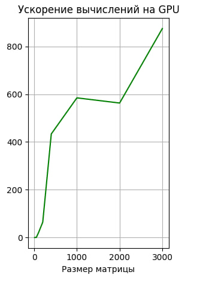
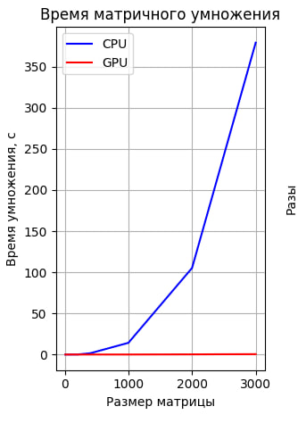

<h1 align="center">1-ая Лабораторная работа HPC matmull </h1>
<h2> В данный лаборатрной работе необходимо произвести перемножение мариц</h2>

Я реализовал данную лаборатрную работу на c++, с использованием технологий cuda

Краткое описание алгоритма реализации:

<ol>
	<li>Перед всеми функциями, ассоциированными с GPU, выполняется заполнение матриц А и В случайными числами на графическом процессоре с использованием функции fillMatrixRandomly. Далее, матрицы копируются на хост с использованием функции cudaMemcpy, чтобы результаты могли быть выведены.</li>
	<li>Затем выполняется умножение матриц на GPU с использованием функции matrixMultiplicationKernel, представляет собой ядро (kernel) для умножения матриц на GPU с использованием технологии CUDA.</li>
	<li>После выполнения умножения матриц на GPU, результат копируется обратно на хост и выводится с помощью функции printMatrixForward</li>
	<li>Затем выполняется умножение матриц на CPU с использованием функции matrixMultiplicationCPU</li>
	<li>В конце освобождаются выделенные ресурсы на девайсе и хосте с помощью функций cudaFree и free</li>
</ol>

Из результатов видно, что с увелечением размерности матриц, растет и ускорение GPU. Для всех эксперементов результирующие матрицы совпадают. Реализациия данной лабораторной работы, была сделана в бакалвариате на курсе Параллельного програмирования.

<h2 align="center">Результаты</h2>
График 1. Время выполения программы
 

График 2. Ускорение 
 

Таблица 1. Результаты
<table>
	<tbody>
		<tr>
			<td colspan="7" aling="center">Результаты</td>
		</tr>
		<tr>
			<td></td>
			<td>10</td>
			<td>25</td>
			<td>50</td>
			<td>100</td>
			<td>200</td>
			<td>400</td>
			<td>1000</td>
			<td>2000</td>
			<td>3000</td>
		</tr>
		<tr>
			<td>CPU</td>
			<td>1.5887e-05</td>
			<td>7.3281e-05</td>
			<td>0.00096928</td>
			<td>0.00576776</td>
			<td>0.0377621</td>
			<td>1.5329</td>
			<td>14.2159</td>
			<td>105.23</td>
			<td>379.277</td>
		</tr>
		<tr>
			<td>GPU</td>
			<td>0.000232432</td>
			<td>0.000204423</td>
			<td>0.00264344</td>
			<td>0.000290221</td>
			<td>0.000588789</td>
			<td>0.00353604</td>
			<td>0.0243184</td>
			<td>0.186924</td>
			<td>0.433675</td>
		</tr>
	</tbody>
</table>

