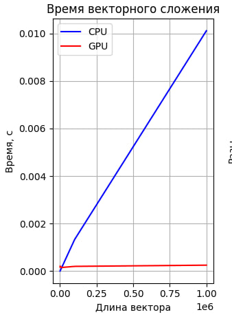
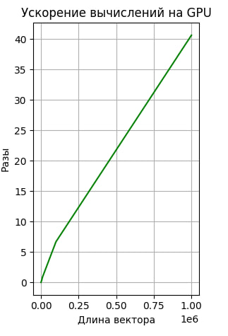

<h1 align="center">2-ая Лабораторная работа HPC vecsum </h1>
<h2> В данный лаборатрной работе необходимо было вычеслить сумму элементов вектора</h2>

Я реализовал данную лаборатрную работу на c++, с использованием технологий cuda

 Для эксперемента я решил провести ряд тестов на google colab

 Для данной задачи процесс параллельных вычислений на GPU можно описать так:

<ol>
	<li>Сначала происходит выделение памяти на хосте (CPU) и заполнение вектора значениями</li>
	<li>Затем выделяется память на GPU с помощью функции cudaMalloc для хранения вектора и результата суммы</li>
	<li>Вектор копируется с хоста на устройство с помощью функции cudaMemcpy</li>
	<li>Вычисляется количество блоков и потоков в блоке для запуска ядра CUDA</li>
	<li>Код ядра vectorSum выполняется параллельно на GPU. Каждый поток выполняет операцию atomicAdd, чтобы атомарно добавить значение элемента вектора к общей сумме</li>
	<li>Результат суммы копируется с устройства на хост с помощью функции cudaMemcpy</li>
	
</ol>
<h2 align="center">Результаты</h2>

Для отображения результатов я используя графики, как видно из графиков, с увелечением размерности вектора удается дойти до ускорения в значение около 40 при N=1000000. 

График 1. Время выполения программы на ПК
 

График 2. Ускорение
 
