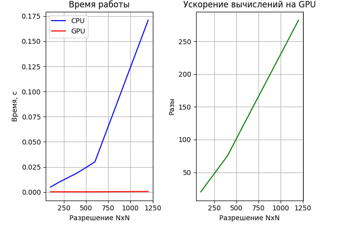

<h1 align="center">4ая Лабораторная работа HPC bilinear_interpolation
 </h1>
<h2> В данный лаборатрной работе необходимо увеличить изображение из размеров NxM до 2Nx2M</h2>

Я реализовал данную лаборатрную работу на C++, с использованием технологий cuda

Краткое описание алгоритма реализации:

<ol>
	<li>Загружает черно-белое изображение из файла "picture600.bmp".</li>
	<li>Проверяет успешность загрузки изображения.</li>
	<li>Измеряет размеры загруженного изображения (ширина и высота).</li>
	<li>Запускает GPU-реализацию билинейной интерполяции на загруженном изображении и измеряет время выполнения.</li>
	<li>Запускает CPU-реализацию билинейной интерполяции на загруженном изображении и измеряет время выполнения.</li>
	<li>Выводит время выполнения GPU и CPU в секундах, а также отношение времени выполнения CPU к GPU.</li>
	<li>Преобразует и сохраняет результаты билинейной интерполяции GPU и CPU в два файла: "result_gpu.bmp" и "result_cpu.bmp" соответственно.</li>
	<li>Освобождает выделенную память.</li>
	<li>Примечание: Программа использует билинейную интерполяцию для увеличения размеров изображения в два раза (высота и ширина).</li>
</ol>

Из результатов видно, что с увелечением размеров картинки, растет и ускорение GPU. Для всех эксперементов результирующие картинки совпадают.

<h2 align="center">Результаты</h2>
 

Исходное изображение.

Увеличенное CPU.

Увеличенное GPU.

